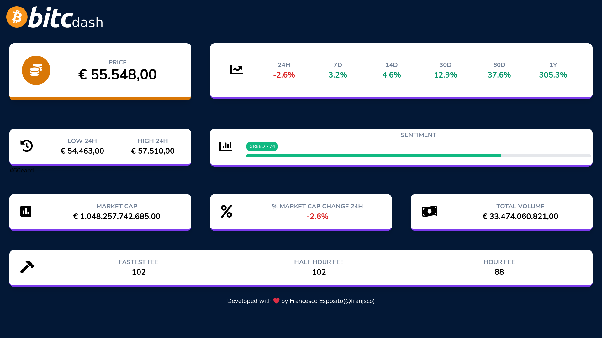

## Bitcdash

Bitcdash is a web application  ...  such as:

- Simple.
- Automatic.
- ...

Screenshot:

Laravel is accessible, powerful, and provides tools required for large, robust applications.

## Configuration

## Usage

wip..

## License

....
